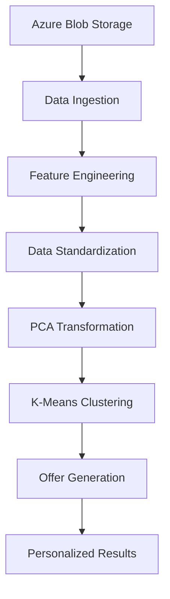

# PySpark Customer Segmentation & Personalized Offers

**Author:** Behrooz Filzadeh

A comprehensive end-to-end data processing pipeline leveraging PySpark for intelligent customer segmentation and personalized offer generation. This project demonstrates enterprise-grade data analytics by integrating Azure Blob Storage, advanced machine learning techniques, and containerized deployment strategies.

## 🎯 Project Overview

This project implements a sophisticated customer analytics pipeline that transforms raw customer data into actionable business insights through automated segmentation and personalized marketing recommendations. By combining the distributed computing power of Apache Spark with modern cloud storage solutions, businesses can scale their customer intelligence operations while maintaining high performance and reliability.

The pipeline processes customer behavioral and demographic data to identify distinct customer segments, then generates tailored marketing offers designed to maximize engagement and conversion rates for each segment.

## ✨ Key Features

### Data Integration & Processing
- **Azure Blob Storage Integration**: Seamless cloud data ingestion with enterprise security
- **Distributed Computing**: Leverages PySpark's distributed architecture for scalable data processing
- **Advanced Feature Engineering**: Automated data preprocessing with standardization and normalization

### Machine Learning Pipeline
- **Principal Component Analysis (PCA)**: Intelligent dimensionality reduction for enhanced model performance
- **K-Means Clustering**: Unsupervised learning for customer segmentation
- **Automated Feature Scaling**: StandardScaler implementation for optimal algorithm performance

### Personalization Engine
- **Dynamic Offer Generation**: Custom User-Defined Functions (UDF) for personalized marketing messages
- **Segment-Based Targeting**: Tailored offers based on customer cluster characteristics
- **Scalable Architecture**: Designed for real-time and batch processing scenarios

### DevOps & Deployment
- **Containerized Environment**: Complete Docker ecosystem with multi-stage builds
- **Orchestrated Services**: Docker Compose for simplified deployment and testing
- **Automated Testing Suite**: Comprehensive unit and integration tests with pytest
- **Environment Management**: Secure credential handling with environment variables

## 🏗️ Technology Stack

| Component | Technology | Purpose |
|-----------|------------|---------|
| **Data Processing** | Apache Spark (PySpark) | Distributed data processing engine |
| **Programming** | Python 3.8+ | Core application development |
| **Cloud Storage** | Azure Blob Storage | Scalable data storage solution |
| **Containerization** | Docker & Docker Compose | Application packaging and orchestration |
| **Machine Learning** | Spark ML | Built-in ML algorithms and utilities |
| **Testing** | pytest | Automated testing framework |
| **Configuration** | python-dotenv | Environment variable management |

## 🔄 Data Processing Workflow



### Pipeline Architecture

1. **Data Ingestion Layer**: Secure connection to Azure Blob Storage with automated data validation
2. **Feature Engineering Layer**: Advanced preprocessing including vector assembly and scaling
3. **Dimensionality Reduction Layer**: PCA implementation for optimal feature space representation
4. **Clustering Layer**: K-Means algorithm for customer segmentation
5. **Personalization Layer**: Dynamic offer generation based on segment characteristics
6. **Output Layer**: Structured results with customer IDs, segments, and personalized offers

## 📁 Project Structure

```
pyspark-customer-segmentation/
├── 📄 Dockerfile                 # Application containerization
├── 📄 docker-compose.yml        # Service orchestration
├── 📄 .env                      # Environment configuration (not tracked)
├── 📄 requirements.txt          # Python dependencies
├── 📂 src/
│   ├── 📄 main.py              # Core PySpark application
│   └── 📄 utils.py             # Utility functions and UDFs
├── 📂 tests/
│   ├── 📄 test_main.py         # Integration tests
│   └── 📄 test_utils.py        # Unit tests
└── 📄 README.md                # Project documentation
```

## 🚀 Quick Start

### Prerequisites

- **Docker Desktop** (v20.10+) or Docker Engine with Docker Compose
- **Azure Storage Account** with:
  - Active storage account with blob container
  - Customer data CSV file uploaded
  - Access keys with read permissions
- **Git** for repository cloning

### Installation & Setup

#### 1. Repository Setup
```bash
git clone https://github.com/your-username/pyspark-customer-segmentation.git
cd pyspark-customer-segmentation
```

#### 2. Azure Configuration
Create a `.env` file in the project root:

```env
# Azure Storage Configuration
AZURE_STORAGE_ACCOUNT_NAME="your_storage_account"
AZURE_STORAGE_ACCOUNT_KEY="your_storage_key"
AZURE_BLOB_CONTAINER="your_container_name"
AZURE_BLOB_FILE="customer_data.csv"

# Application Configuration
SPARK_MASTER_URL="local[*]"
LOG_LEVEL="INFO"
```

#### 3. Data Requirements
Ensure your CSV file contains the following columns:
- `CustomerID`: Unique customer identifier
- `Age`: Customer age (numeric)
- `Annual Income (k$)`: Annual income in thousands
- `Spending Score (1-100)`: Customer spending behavior score

### Execution

#### Production Deployment
```bash
# Build and run the complete pipeline
docker-compose up app

# Run in detached mode
docker-compose up -d app
```

#### Development & Testing
```bash
# Execute test suite
docker-compose up tests

# Run specific test categories
docker-compose run --rm tests pytest tests/test_utils.py -v
```

#### Clean Up
```bash
# Stop all services and remove containers
docker-compose down --volumes --remove-orphans
```

## 🔧 Advanced Configuration

### Customization Options

#### Feature Engineering
Modify feature selection in `src/main.py`:
```python
feature_columns = ["Age", "Annual_Income", "Spending_Score", "Custom_Feature"]
```

#### Clustering Parameters
Adjust clustering configuration:
```python
# Number of clusters
kmeans = KMeans(k=5, seed=42)

# PCA components
pca = PCA(k=3, inputCol="scaled_features", outputCol="pca_features")
```

#### Personalization Logic
Enhance offer generation in `src/utils.py`:
```python
def generate_offer(cluster_id):
    offer_strategies = {
        0: "Premium Customer - 25% off luxury items",
        1: "Budget Conscious - Buy 2 Get 1 Free",
        2: "High Spender - Exclusive VIP access",
        3: "Moderate Spender - 15% off selected items",
        4: "New Customer - Welcome bonus 20% off"
    }
    return offer_strategies.get(cluster_id, "Standard 10% discount")
```

## 🧪 Testing Framework

### Test Categories

#### Unit Tests (`tests/test_utils.py`)
- Offer generation logic validation
- Edge case handling
- Input/output verification

#### Integration Tests (`tests/test_main.py`)
- End-to-end pipeline execution
- Azure connectivity validation
- Data processing workflow verification

### Running Tests
```bash
# Full test suite
docker-compose up tests

# Specific test files
docker-compose run --rm tests pytest tests/test_utils.py::test_generate_offer -v

# Test coverage report
docker-compose run --rm tests pytest --cov=src tests/
```

## 📊 Performance Optimization

### Spark Configuration
Optimize for your dataset size:

```python
spark = SparkSession.builder \
    .appName("CustomerSegmentation") \
    .config("spark.executor.memory", "4g") \
    .config("spark.executor.cores", "2") \
    .config("spark.sql.adaptive.enabled", "true") \
    .config("spark.sql.adaptive.coalescePartitions.enabled", "true") \
    .getOrCreate()
```

### Resource Management
- **Small datasets (< 1GB)**: Default local configuration
- **Medium datasets (1-10GB)**: Increase executor memory to 4-8GB
- **Large datasets (> 10GB)**: Consider cluster deployment with multiple executors

## 🔍 Troubleshooting

### Common Issues & Solutions

#### Azure Authentication Errors
```bash
# Verify credentials
az storage account show --name your_storage_account

# Test connectivity
docker-compose run --rm app python -c "
import os
from dotenv import load_dotenv
load_dotenv()
print('Account:', os.getenv('AZURE_STORAGE_ACCOUNT_NAME'))
"
```

#### Memory Issues
```bash
# Increase Docker memory allocation
# Docker Desktop: Settings > Resources > Memory > 4GB+

# Monitor container resources
docker stats
```

#### JAR Dependencies
```bash
# Verify Hadoop-Azure packages
docker-compose run --rm app pyspark --packages org.apache.hadoop:hadoop-azure:3.3.6
```

## 📈 Business Applications

### Use Cases
- **Retail**: Customer behavior analysis and targeted promotions
- **E-commerce**: Personalized product recommendations
- **Financial Services**: Risk assessment and customer lifetime value prediction
- **Telecommunications**: Churn prevention and service optimization

### ROI Metrics
- **Engagement Rate**: Measure response to personalized offers
- **Conversion Rate**: Track segment-specific performance
- **Customer Lifetime Value**: Monitor long-term segment value
- **Campaign Efficiency**: Compare targeted vs. generic campaigns

## 🤝 Contributing

We welcome contributions to improve this customer segmentation pipeline:

1. **Fork** the repository
2. **Create** a feature branch: `git checkout -b feature/amazing-feature`
3. **Commit** your changes: `git commit -m 'Add amazing feature'`
4. **Push** to the branch: `git push origin feature/amazing-feature`
5. **Open** a Pull Request

### Development Guidelines
- Follow PEP 8 Python coding standards
- Add comprehensive unit tests for new features
- Update documentation for API changes
- Ensure Docker builds pass successfully

## 📄 License

This project is licensed under the MIT License - see the [LICENSE](LICENSE) file for details.

## 📧 Contact

**Behrooz Filzadeh**
- Email: behrooz.filzadeh@gmail.com

## 🙏 Acknowledgments

- Apache Spark community for the robust distributed computing framework
- Microsoft Azure team for reliable cloud storage solutions
- Open source contributors who make projects like this possible

---

⭐ **Star this repository** if you find it helpful for your customer analytics projects!

Built with ❤️ by [Behrooz Filzadeh](https://github.com/behroozfilzadeh)
